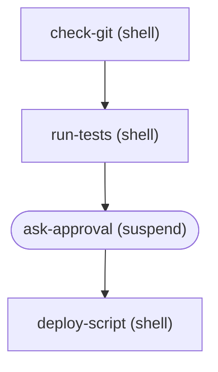

# opencode-workflows

Workflow automation plugin for OpenCode using the Mastra workflow engine. Define deterministic, multi-step processes that agents can trigger to perform complex tasks reliably.

## Features

- **Deterministic Automation**: Define rigid, multi-step processes (DAGs) in JSON
- **Agentic Triggering**: Agents can call workflows as tools
- **Hybrid Execution**: Mix shell commands, API calls, and LLM prompts
- **Human-in-the-Loop**: Suspend workflows for human approval
- **Parallel Execution**: Run independent steps concurrently

## Installation

Install the plugin in your project's `.opencode/plugin` directory:

```bash
npm install opencode-workflows
```

Add `opencode-workflows@latest` to your `opencode.jsonc` config file under the `plugins` section.

### Configuration

The plugin uses sensible defaults but can be configured via environment variables:

| Environment Variable | Default | Description |
|---------------------|---------|-------------|
| `WORKFLOW_DIRS` | `.opencode/workflows,~/.opencode/workflows` | Comma-separated directories to scan for workflow JSON files |
| `WORKFLOW_DB_PATH` | `.opencode/data/workflows.db` | SQLite database path for persisting workflow runs |
| `WORKFLOW_TIMEOUT` | `300000` (5 min) | Global timeout for workflow execution in milliseconds |
| `WORKFLOW_VERBOSE` | `false` | Enable verbose debug logging |

### Persistence

Workflow runs are automatically persisted to a LibSQL (SQLite) database. This enables:

- **Crash Recovery**: Active runs are restored on plugin restart
- **Run History**: Query past workflow executions via `/workflow runs`
- **Suspend/Resume**: Suspended workflows survive session restarts

The database is created automatically at the configured `dbPath`.

### Secrets and Sensitive Input Handling

Workflows often need to handle sensitive data like API keys, passwords, and tokens. The plugin provides built-in security features to protect these values:

#### Marking Inputs as Secrets

Add a `secrets` array to your workflow definition listing which input names contain sensitive data:

```json
{
  "id": "deploy-with-credentials",
  "description": "Deploy using API credentials",
  "inputs": {
    "environment": "string",
    "apiKey": "string",
    "dbPassword": "string"
  },
  "secrets": ["apiKey", "dbPassword"],
  "steps": [
    {
      "id": "deploy",
      "type": "shell",
      "command": "deploy.sh --env={{inputs.environment}} --key={{inputs.apiKey}}"
    }
  ]
}
```

#### What Gets Protected

1. **Log Masking**: Any input listed in `secrets` is replaced with `***` in console output
   - The command `deploy.sh --env=prod --key=sk-12345` appears as `deploy.sh --env=prod --key=***`

2. **Environment Variables**: All `{{env.*}}` interpolations are automatically treated as secrets
   - No need to add them to the `secrets` array
   - `{{env.API_KEY}}` is always masked in logs

3. **Storage Encryption**: When an encryption key is configured, secret inputs are encrypted at rest in the SQLite database using AES-256-GCM

#### Configuring Storage Encryption

To enable encryption for secrets stored in the database, configure an encryption key:

```typescript
import { createWorkflowPlugin } from "opencode-workflows";

const plugin = createWorkflowPlugin({
  storage: {
    encryptionKey: process.env.WORKFLOW_ENCRYPTION_KEY
  }
});
```

The encryption key should be:
- Exactly 32 characters for AES-256
- Stored securely (environment variable, secrets manager)
- Never committed to version control

When encryption is enabled:
- Secret inputs are encrypted before being saved to the database
- Secrets are automatically decrypted when loading workflow runs
- Non-secret inputs remain unencrypted for easier debugging

#### Example: Secure API Deployment

```json
{
  "id": "secure-deploy",
  "description": "Deploy with encrypted credentials",
  "inputs": {
    "version": "string",
    "apiToken": "string",
    "webhookSecret": "string"
  },
  "secrets": ["apiToken", "webhookSecret"],
  "steps": [
    {
      "id": "deploy",
      "type": "shell",
      "command": "deploy --version={{inputs.version}} --token={{inputs.apiToken}}"
    },
    {
      "id": "notify",
      "type": "http",
      "method": "POST",
      "url": "https://api.example.com/webhooks",
      "headers": {
        "Authorization": "Bearer {{inputs.webhookSecret}}"
      },
      "body": {
        "version": "{{inputs.version}}",
        "status": "deployed"
      },
      "after": ["deploy"]
    }
  ]
}
```

In the logs, you'll see:
```
> deploy --version=1.0.0 --token=***
```

And in the database, the `apiToken` and `webhookSecret` values are stored encrypted.

## Workflow Definitions

Create workflow definitions in `.opencode/workflows/` as JSON or JSONC files. JSONC files support comments for better documentation:

```jsonc
{
  // Unique workflow identifier
  "id": "deploy-prod",
  "description": "Deploys the application to production",
  "inputs": {
    "version": "string"
  },
  "steps": [
    {
      "id": "check-git",
      "type": "shell",
      "command": "git status --porcelain",
      "description": "Ensure git is clean"
    },
    {
      "id": "run-tests",
      "type": "shell",
      "command": "npm test",
      "after": ["check-git"]
    },
    {
      "id": "ask-approval",
      "type": "suspend",
      "description": "Wait for user to approve deployment",
      "after": ["run-tests"]
    },
    {
      "id": "deploy-script",
      "type": "shell",
      "command": "npm run deploy -- --tag {{inputs.version}}",
      "after": ["ask-approval"]
    }
  ]
}
```

### Input Validation

When a workflow defines inputs, all inputs are **required by default**. If you try to run a workflow without providing all required inputs, the plugin will return a helpful error message listing the missing inputs:

```
$ /workflow run deploy-prod

Missing required input(s) for workflow **deploy-prod**:

- **version** (string)

Usage: `/workflow run deploy-prod version=<value>`
```

This validation happens before the workflow starts, ensuring you don't waste time on a run that would fail due to missing inputs.

## Step Types

### Shell Step
Execute shell commands:
```json
{
  "id": "build",
  "type": "shell",
  "command": "npm run build",
  "cwd": "./packages/app",
  "env": { "NODE_ENV": "production" },
  "failOnError": true,
  "timeout": 60000,
  "retry": { "attempts": 3, "delay": 1000 }
}
```

| Option | Type | Default | Description |
|--------|------|---------|-------------|
| `command` | `string` | required | Shell command to execute |
| `cwd` | `string` | - | Working directory (supports interpolation) |
| `env` | `object` | - | Environment variables (supports interpolation) |
| `failOnError` | `boolean` | `true` | Fail workflow if command exits non-zero |
| `timeout` | `number` | - | Step-specific timeout in milliseconds |
| `retry` | `object` | - | Retry configuration: `{ attempts: number, delay?: number }` |

### Tool Step
Invoke OpenCode tools:
```json
{
  "id": "send-notification",
  "type": "tool",
  "tool": "slack_send",
  "args": {
    "channel": "#releases",
    "text": "Deployed {{inputs.version}}"
  }
}
```

### Agent Step
Invoke a named OpenCode agent or prompt an LLM directly:

**Named Agent (recommended):**
```json
{
  "id": "security-review",
  "type": "agent",
  "agent": "security-reviewer",
  "prompt": "Review this code for security issues:\n\n{{steps.read_file.result}}",
  "maxTokens": 1000
}
```

This invokes a pre-defined OpenCode agent by name. The agent's system prompt, model, and other settings are configured in OpenCode's agent definitions.

**Inline LLM (fallback):**
```json
{
  "id": "generate-changelog",
  "type": "agent",
  "prompt": "Generate a changelog for version {{inputs.version}}",
  "system": "You are a technical writer.",
  "maxTokens": 1000
}
```

This makes a direct LLM call with an optional system prompt. Note that `model` selection may not be supported by the plugin system - the configured default model will be used.

| Option | Type | Description |
|--------|------|-------------|
| `agent` | `string` | Name of a pre-defined OpenCode agent to invoke |
| `prompt` | `string` | The prompt to send (required, supports interpolation) |
| `system` | `string` | System prompt for inline LLM calls (ignored if `agent` is specified) |
| `maxTokens` | `number` | Maximum tokens for response |

### Suspend Step
Pause for human input:
```json
{
  "id": "approval",
  "type": "suspend",
  "message": "Ready to deploy. Resume to continue.",
  "description": "Wait for deployment approval"
}
```

### Wait Step
Pause workflow execution for a specified duration (platform-independent alternative to `shell: sleep`):
```json
{
  "id": "wait-for-deploy",
  "type": "wait",
  "durationMs": 5000,
  "description": "Wait for deployment to propagate"
}
```

Useful for waiting for external systems (e.g., waiting for a deployed URL to become live, rate limiting API calls, or giving services time to initialize).

| Option | Type | Default | Description |
|--------|------|---------|-------------|
| `durationMs` | `number` | required | Duration to wait in milliseconds |

Wait step output includes:
- `completed` - Whether the wait completed successfully (always `true` unless skipped)
- `durationMs` - The duration that was waited

### HTTP Step
Make HTTP requests:
```json
{
  "id": "notify-slack",
  "type": "http",
  "method": "POST",
  "url": "https://hooks.slack.com/services/xxx",
  "headers": {
    "Content-Type": "application/json"
  },
  "body": {
    "text": "Deployed {{inputs.version}}"
  },
  "failOnError": true
}
```

HTTP step output includes:
- `body` - Parsed JSON response, or `null` if response is not valid JSON
- `text` - Raw response text (useful for non-JSON responses or debugging)
- `status` - HTTP status code
- `headers` - Response headers

### File Step
Read, write, or delete files:
```json
{
  "id": "write-version",
  "type": "file",
  "action": "write",
  "path": "./version.txt",
  "content": "{{inputs.version}}"
}
```

```json
{
  "id": "read-config",
  "type": "file",
  "action": "read",
  "path": "./config.json"
}
```

### Iterator Step
Iterate over an array and execute a step for each item (batch processing):

```json
{
  "id": "lint-files",
  "type": "iterator",
  "items": "{{steps.find-files.result}}",
  "runStep": {
    "type": "shell",
    "command": "eslint {{inputs.item}}"
  }
}
```

The iterator provides special context variables for each iteration:
- `{{inputs.item}}` - The current item being processed
- `{{inputs.index}}` - The zero-based index of the current item

For objects in the array, access nested properties:
```json
{
  "id": "deploy-services",
  "type": "iterator",
  "items": "{{inputs.services}}",
  "runStep": {
    "type": "shell",
    "command": "deploy {{inputs.item.name}} --region {{inputs.item.region}}"
  }
}
```

The iterator step collects results from all iterations:
```json
{
  "id": "use-results",
  "type": "shell",
  "command": "echo 'Processed {{steps.lint-files.count}} files'",
  "after": ["lint-files"]
}
```

Iterator step output includes:
- `results` - Array of outputs from each iteration
- `count` - Number of items processed

| Option | Type | Description |
|--------|------|-------------|
| `items` | `string` | Interpolation expression resolving to an array (required) |
| `runStep` | `object` | Step definition to execute for each item (required). Supports shell, tool, agent, http, and file step types. |

**Limitations:**
- Nested iterators are not supported
- Suspend steps are not supported within iterators

## Commands

Use the `/workflow` command:

- `/workflow list` - List available workflows
- `/workflow show <id>` - Show workflow details
- `/workflow graph <id>` - Show workflow DAG as Mermaid diagram
- `/workflow run <id> [param=value ...]` - Run a workflow
- `/workflow status <runId>` - Check run status
- `/workflow resume <runId> [data]` - Resume a suspended workflow
- `/workflow cancel <runId>` - Cancel a running workflow
- `/workflow runs [workflowId]` - List recent runs

### Visualizing Workflows

The `graph` command generates a Mermaid diagram showing the workflow's step dependencies:

```
/workflow graph deploy-prod
```

Output:


Different step types are shown with distinct shapes:
- **Rectangle** `["..."]` - shell, tool, http, file steps
- **Stadium** `([...])` - suspend steps (human-in-the-loop)
- **Hexagon** `{{...}}` - agent steps (LLM calls)

### Parameter Type Inference

When passing parameters via `/workflow run`, values are automatically converted to their appropriate types:

| Input | Parsed As |
|-------|-----------|
| `count=5` | `number` (5) |
| `ratio=3.14` | `number` (3.14) |
| `enabled=true` | `boolean` (true) |
| `debug=false` | `boolean` (false) |
| `name=hello` | `string` ("hello") |
| `url=http://example.com?foo=bar` | `string` (preserved) |

This ensures workflow inputs match their expected schema types without manual conversion.

## Agent Tool

Agents can trigger workflows using the `workflow` tool:

```typescript
// List workflows
workflow({ mode: "list" })

// Run a workflow
workflow({ 
  mode: "run", 
  workflowId: "deploy-prod",
  params: { version: "1.2.0" }
})

// Check status
workflow({ mode: "status", runId: "abc-123" })

// Resume suspended workflow
workflow({ 
  mode: "resume", 
  runId: "abc-123",
  resumeData: { approved: true }
})
```

## Template Interpolation

Use `{{expression}}` syntax to reference:
- `{{inputs.paramName}}` - Workflow input parameters
- `{{steps.stepId.stdout}}` - Shell step stdout
- `{{steps.stepId.response}}` - Agent step response
- `{{steps.stepId.result}}` - Tool step result
- `{{steps.stepId.body}}` - HTTP step response body (parsed JSON or null)
- `{{steps.stepId.text}}` - HTTP step raw response text
- `{{steps.stepId.content}}` - File step content (read action)
- `{{env.VAR_NAME}}` - Environment variables
- `{{run.id}}` - Current workflow run ID
- `{{run.workflowId}}` - Workflow definition ID
- `{{run.startedAt}}` - ISO timestamp when run started

### Nested Property Access

You can access deeply nested properties using dot notation:
```json
{
  "id": "use-api-data",
  "type": "shell",
  "command": "echo 'User ID: {{steps.api-call.body.data.user.id}}'"
}
```

This works for:
- JSON responses from HTTP steps: `{{steps.http.body.users[0].name}}`
- Complex tool results: `{{steps.tool.result.metadata.version}}`
- Nested input objects (when passed as JSON): `{{inputs.config.database.host}}`

### Type Preservation

When a template contains only a single variable reference (e.g., `"{{inputs.count}}"`), the original type is preserved. This means:
- `"{{inputs.count}}"` with `count=42` returns the number `42`, not the string `"42"`
- `"Count: {{inputs.count}}"` returns `"Count: 42"` (string interpolation)

### Conditional Execution

Steps can include a `condition` to control execution:
```json
{
  "id": "deploy-prod",
  "type": "shell",
  "command": "deploy.sh",
  "condition": "{{inputs.environment}}"
}
```
The step is skipped if the condition evaluates to `"false"`, `"0"`, or `""`.

## Dependencies

Steps can declare dependencies using `after`:

```json
{
  "id": "deploy",
  "type": "shell",
  "command": "deploy.sh",
  "after": ["build", "test"]
}
```

Steps at the same dependency level run in parallel.

## Crash Recovery

Workflow state is persisted to SQLite after each step completes. This provides automatic crash recovery:

1. **Automatic Restoration**: When the plugin starts, any "running" or "suspended" workflows are automatically restored
2. **Idempotent Execution**: Completed steps are skipped on resume, preventing duplicate side effects
3. **Suspend Preservation**: Suspended workflows waiting for human input survive restarts

### How It Works

After each step completes, the workflow state (including all step results) is saved to the database. On restart:
- Steps with existing results are skipped (idempotency)
- The workflow resumes from the first incomplete step
- For suspended workflows, the resume data is preserved

This means you can safely restart OpenCode without losing workflow progress.

## Triggers

Workflows can be automatically triggered by cron schedules or file change events.

### Schedule Triggers (Cron)

Use cron expressions to run workflows on a schedule:

```json
{
  "id": "nightly-backup",
  "trigger": {
    "schedule": "0 2 * * *"
  },
  "steps": [
    {
      "id": "backup",
      "type": "shell",
      "command": "backup.sh"
    }
  ]
}
```

Common cron patterns:
| Pattern | Description |
|---------|-------------|
| `* * * * *` | Every minute |
| `0 * * * *` | Every hour |
| `0 0 * * *` | Daily at midnight |
| `0 2 * * *` | Daily at 2am |
| `0 0 * * 0` | Weekly on Sunday |
| `*/5 * * * *` | Every 5 minutes |
| `0 9-17 * * 1-5` | Every hour 9-5 Mon-Fri |

### File Change Triggers

Trigger workflows when files matching a glob pattern change:

```json
{
  "id": "test-on-save",
  "trigger": {
    "event": "file.change",
    "pattern": "src/**/*.ts"
  },
  "steps": [
    {
      "id": "run-tests",
      "type": "shell",
      "command": "npm test"
    }
  ]
}
```

The `changedFile` input is automatically passed to the workflow, containing the path of the file that triggered the workflow:

```json
{
  "id": "lint-on-save",
  "trigger": {
    "event": "file.change",
    "pattern": "**/*.{ts,tsx}"
  },
  "steps": [
    {
      "id": "lint",
      "type": "shell",
      "command": "eslint {{inputs.changedFile}}"
    }
  ]
}
```

Glob pattern examples:
| Pattern | Matches |
|---------|---------|
| `**/*.ts` | All TypeScript files |
| `src/**/*.{ts,tsx}` | TypeScript files in src/ |
| `*.json` | JSON files in root |
| `src/components/**/*` | Everything in components/ |

File change triggers are debounced (300ms) to prevent rapid repeated executions when multiple file system events fire for a single save operation.

### Trigger Configuration

| Option | Type | Description |
|--------|------|-------------|
| `schedule` | `string` | Cron expression for scheduled execution |
| `event` | `string` | Event type (currently only `file.change` is supported) |
| `pattern` | `string` | Glob pattern for file matching (used with `file.change` event) |

## Agent Orchestration

One of the most powerful use cases is orchestrating multiple AI agents in a deterministic pipeline. This lets you build reliable, repeatable AI workflows where specialized agents collaborate on complex tasks.

### Multi-Agent Code Review

This example chains multiple specialized agents to review code from different perspectives, then synthesizes their findings:

```json
{
  "id": "code-review",
  "name": "Multi-Agent Code Review",
  "description": "Parallel expert review with synthesis",
  "inputs": {
    "file": "string"
  },
  "steps": [
    {
      "id": "read_file",
      "type": "tool",
      "tool": "read",
      "args": { "filePath": "{{inputs.file}}" }
    },
    {
      "id": "security_review",
      "type": "agent",
      "agent": "security-reviewer",
      "prompt": "Review this code for security issues:\n\n{{steps.read_file.result}}",
      "after": ["read_file"]
    },
    {
      "id": "perf_review",
      "type": "agent",
      "agent": "performance-reviewer",
      "prompt": "Review this code for performance issues:\n\n{{steps.read_file.result}}",
      "after": ["read_file"]
    },
    {
      "id": "quality_review",
      "type": "agent",
      "agent": "quality-reviewer",
      "prompt": "Review this code for quality issues:\n\n{{steps.read_file.result}}",
      "after": ["read_file"]
    },
    {
      "id": "synthesize",
      "type": "agent",
      "agent": "tech-lead",
      "prompt": "Combine these reviews into a single report:\n\n## Security\n{{steps.security_review.response}}\n\n## Performance\n{{steps.perf_review.response}}\n\n## Quality\n{{steps.quality_review.response}}",
      "after": ["security_review", "perf_review", "quality_review"]
    },
    {
      "id": "approve_fixes",
      "type": "suspend",
      "message": "Review complete:\n\n{{steps.synthesize.response}}\n\nResume to generate fixes.",
      "after": ["synthesize"]
    },
    {
      "id": "generate_fixes",
      "type": "agent",
      "agent": "code-fixer",
      "prompt": "Fix the critical and high severity issues:\n\nOriginal:\n{{steps.read_file.result}}\n\nIssues:\n{{steps.synthesize.response}}",
      "after": ["approve_fixes"]
    }
  ]
}
```

> **Note**: This example assumes you have agents named `security-reviewer`, `performance-reviewer`, `quality-reviewer`, `tech-lead`, and `code-fixer` configured in OpenCode. Alternatively, you can use inline LLM calls with `system` prompts instead of named agents.

Run it with:
```
/workflow run code-review file=src/api/auth.ts
```

### Orchestration Patterns

| Pattern | Description | Example |
|---------|-------------|---------|
| **Sequential Chain** | Each agent uses the previous agent's output | Planner → Executor → Reviewer |
| **Parallel Experts** | Multiple agents analyze independently, then synthesize | Security + Performance + Quality → Summary |
| **Tool-Augmented** | Agents use tools to read files, search code, make API calls | Read file → Analyze → Write fix |
| **Human-in-the-Loop** | `suspend` steps for approval between agent actions | Generate → Approve → Apply |
| **Conditional Routing** | Use `condition` to skip agents based on results | Skip deploy agent if tests failed |

### Why Use Workflows for Agent Orchestration?

- **Deterministic**: Unlike free-form agent conversations, workflows execute the same steps every time
- **Auditable**: Each step's output is captured and can be reviewed
- **Resumable**: Workflows persist to disk and survive restarts
- **Composable**: Build complex pipelines from simple, focused agents
- **Controllable**: Human approval gates prevent unwanted actions

## License

MIT
